📊 CSV Data Storyteller

CSV Data Storyteller is a sophisticated, AI-driven web application designed to bridge the gap between raw data and actionable business intelligence. Built with Streamlit and powered by the Google Gemini API, this tool empowers users to upload any CSV file and instantly receive a comprehensive data analysis, including a high-level summary and three actionable business insights.

The standout feature of this project is its Smart Visualization capability. Through advanced prompt engineering, the application intelligently instructs the AI to analyze the dataset's context and generate the most appropriate and insightful visualization. It then executes the AI-generated Python code to render a clean, professional chart directly in the app.

This project serves as a powerful demonstration of building robust, production-ready AI tools that solve real-world business problems. It showcases skills in modern web app development, strategic AI integration, and the critical art of prompt engineering to guide and control LLM output.

✨ Features

Dynamic Data Upload: Users can upload any CSV file to begin their analysis.

AI-Powered Insights: Utilizes the Google Gemini API to generate a high-level summary and actionable business insights from the data.

Smart Visualizations: Employs an advanced prompt engineering strategy to have the AI generate and execute Python code, creating the most appropriate visualization for the given dataset.

Uniform & Secure API Key Management: Uses Streamlit's Secrets Management (st.secrets) for secure and consistent handling of API keys for both local and cloud environments.

Workflow of the application:

```mermaid
graph TD
    subgraph User Interaction
        A[Start: User visits the app] --> B(User uploads a CSV file);
        B --> D[Display: Show Data Preview];
        D --> E{User chooses an action};
    end

    subgraph AI Insight Generation
        E -->|"Generate Insights ✨"| F[Backend: Prepare data summary];
        F --> G[Backend: Construct text prompt];
        G --> H((External: Call Gemini API));
        H --> I[Backend: Receive and store text insights];
    end

    subgraph AI Visualization Generation
        E -->|"Suggest a Visualization 📈"| J[Backend: Construct code prompt];
        J --> K((External: Call Gemini API));
        K --> M[Backend: Clean and store AI-generated code];
        M --> N[Backend: Execute code to generate plot];
        N --> O[Backend: Store plot figure in session state];
    end

    subgraph Display Results
        I --> L[Display: Show results from session state];
        O --> L;
        L --> P[End: Awaiting next action];
    end
```

🚀 How to Run and Deploy

Follow these steps to run the app locally and deploy it to Streamlit Community Cloud.

1. Local Development Setup

Step 1: Create a GitHub Repository

Create a new public repository on GitHub. Do not initialize it with a README or .gitignore file.

Step 2: Push Your Code to GitHub

Open a terminal in your project's root folder (where app.py is located).

Initialize a new Git repository locally:

git init

Add all your project files to the staging area:

git add .

Create your first commit:

git commit -m "Initial commit of the CSV Data Storyteller app"

Go to your new repository's page on GitHub. Click the "Code" button and copy the HTTPS URL.

Link your local repository to the remote one on GitHub:

git remote add origin YOUR_REPOSITORY_URL_HERE

Push your code to the main branch on GitHub:

git push -u origin main

Step 3: Set Up Local Secrets

In your project's root folder, create a new folder named .streamlit.

Inside the .streamlit folder, create a new file named secrets.toml.

Open secrets.toml and add your Google Gemini API key:

# This key is only for your local development and will be ignored by Git.

GEMINI_API_KEY = "YOUR_API_KEY_GOES_HERE"

The .gitignore file will ensure this folder is never uploaded to GitHub.

Step 4: Run the App Locally

Create and activate a Python virtual environment.

Install the dependencies: pip install -r requirements.txt

Run the app from your terminal: streamlit run app.py

2. Deployment to Streamlit Cloud

Step 1: Connect Your GitHub Repository

Sign up or log in to Streamlit Community Cloud.

Click the "New app" button.

Choose your repository, branch, and main file path (app.py).

Step 2: Add Your API Key to Streamlit Secrets

Click on "Advanced settings...".

In the "Secrets" text box, add your Google Gemini API key in the same format as your local file:

GEMINI_API_KEY = "YOUR_API_KEY_GOES_HERE"

Click "Save".

Step 3: Deploy!

Click the "Deploy!" button.

Your app will now be built and deployed. In a few minutes, you will have a live, public URL for your project.

This project was built to showcase modern AI application development, focusing on practical business use cases and robust engineering practices.
